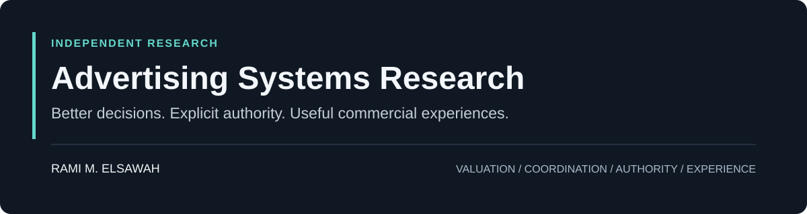

  

# Advertising Systems Research

**Independent research into how advertising systems value opportunities, combine intelligence, delegate authority, and earn user trust.**

By **Rami M. Elsawah**

This repository examines structural problems in advertising: what a decision should account for, who should be allowed to make it, and what evidence would show that it improved an outcome.

The working premise is that better models alone may not resolve weaknesses in how decisions are framed, coordinated, and governed. Each research direction below turns that premise into a hypothesis that can be challenged.

## Research portfolio

| Research direction | Core question | Intended value |
| --- | --- | --- |
| [Experience Bidding](research/experience-bidding.md) | What can the next advertising action add, given what has already happened? | Allocate spend according to incremental contribution across a journey. |
| [OpenDecisioning](research/open-decisioning.md) | Can independent parties contribute useful intelligence without centralizing their underlying data and models? | Make specialized intelligence usable across organizational boundaries. |
| [Agentic Advertising Operating System](research/agentic-advertising-operating-system.md) | Under what authority may an advertising agent act, and how can that action be explained or stopped? | Make autonomous execution accountable and bounded. |
| [AI-Native Commercial Surfaces](research/ai-native-commercial-surfaces.md) | How can commercial options enter an AI conversation without compromising its usefulness? | Support commercial discovery while preserving trust in the assistant's reasoning. |

**Public status: exploratory hypotheses.** This repository contains research briefs and proposed evaluation criteria. It does not currently publish implementation code, reproducible experiments, or empirical validation. Intended value is a research objective, not a demonstrated result.

## Start here

- **For product and business readers:** choose a brief above. Start with the problem, intended value, and illustrative scenario.
- **For researchers and engineers:** examine the assumptions, proposed evaluation, and evidence that would weaken each hypothesis.
- **For collaborators:** read the [research method](docs/research-method.md) and [contribution guide](CONTRIBUTING.md). Counterexamples and relevant prior work are especially useful.

## Principles under investigation

**Incremental value.** Eligibility is not evidence of relevance; relevance is not evidence of additional value. A useful decision framework should be able to consider abstention.

**Intelligence across boundaries.** A conclusion may be useful even when its underlying data or model cannot be shared. Whether that conclusion is reliable, safe to disclose, and economical to use still needs to be established.

**Explicit authority.** Autonomous action needs a defined objective, constraints, an accountable owner, and a way to revoke permission.

**Trust as a design constraint.** Commercial participation should be evaluated against the usefulness and integrity of the customer experience, alongside economic outcomes.

## How the directions relate

These are distinct questions that may inform one another:

| Decision layer | Research direction | Main concern |
| --- | --- | --- |
| Valuation | Experience Bidding | Whether the next action adds value |
| Coordination | OpenDecisioning | How independent intelligence contributes |
| Authority | Agentic Advertising Operating System | Whether an action is permitted and accountable |
| Experience | AI-Native Commercial Surfaces | How commercial participation affects the user |

This is a research map, not a claim that a unified platform has been built.

## Contribute a substantive challenge

The most useful feedback identifies an existing solution, exposes a failed assumption, or proposes a simpler test. [Open a research discussion as an issue](https://github.com/yoda-sahb/Ad_Innovation_Personal/issues/new?template=research-feedback.md), or propose a focused documentation change.

---

Personal, independent, company-agnostic research. The material does not represent employer plans or claim deployed capabilities. Detailed mechanisms, prototypes, prior-art work, and restricted implementation details remain private.
