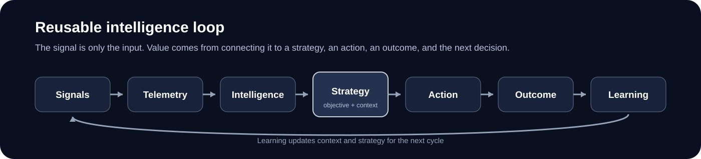

# First-Party Intelligence for Advertising
## From Signals to Learning

> **Working paper.** Personal, independent, company-agnostic R&D. This paper explores a product and market hypothesis. It is not a description of any employer roadmap, deployed system, or confidential implementation.

  

## Executive summary

Advertising systems are already very good at optimizing with the information they have. They can build audiences, predict performance, set bids, choose media, change budgets, and learn from outcomes.

The next opportunity may be less about building another optimization engine and more about improving the information those engines can use.

Companies across many industries know things about customers that advertising platforms may not know. They may know what a customer owns, what they are doing now, what they recently consumed, what stage of a relationship they are in, what they may need next, or what they have already experienced. That knowledge can exist whether or not the company sells advertising inventory.

The product opportunity is to turn that unique first-party knowledge into decision-ready intelligence and prove that marketers make better decisions when they have it.

This paper uses a simple framework:

> **Signals → Telemetry → Intelligence → Strategy → Action → Outcome → Learning**

The key transition is **Intelligence → Strategy**. Intelligence says what may be true. Strategy decides what to do about it, given an objective, the history of what has already happened, the available actions, and the constraints that must be respected.

That distinction matters because advertising does not create value by producing more predictions. It creates value when better information changes how budget is allocated and produces a better outcome.

A marketer does not need every signal owner to become a media company, a demand platform, or a new optimization stack. The signal owner can specialize in understanding the part of the customer relationship it knows best. The advertising system can specialize in allocating budget across opportunities. The connection between them is measurable decision intelligence.

---

## Why this matters

The advertising industry has spent years improving decision systems. Better models, better identity, better measurement, more automation, and more data have all made buying platforms more capable.

But there is still a structural limit: a decision system cannot use information it does not have.

Some of the most useful information sits outside the advertising system because it is created inside a direct customer relationship. A business may see product ownership, service activity, usage, content consumption, a current session, an upcoming need, a change in behavior, or the result of an earlier interaction. An external buying platform may see none of that directly.

That creates an information gap.

The obvious answer is to move more data into the advertising platform. Sometimes that is appropriate. But it is not the only answer, and it may not be the best one. Raw data can be difficult to interpret, difficult to govern, slow to integrate, or redundant with information the buyer already has.

A better question is:

> **What does the signal owner know that the advertising decision-maker does not already know, and would knowing it materially change the decision?**

That question keeps the product focused on incremental value rather than the volume of data exposed.

It also changes the market boundary. First-party advertising intelligence does not have to be attached to owned advertising inventory. A company can create value even when the eventual ad appears somewhere else. If its intelligence helps a marketer decide where to spend, whom to reach, what to promote, when to act, or when to wait, it has influenced an economically meaningful decision.

For planned marketing budgets, the useful default assumption is that the budget is meant to be deployed unless there is evidence otherwise. If one opportunity becomes unattractive, the money does not necessarily disappear. It can move to another customer, another channel, another message, another time, or another opportunity.

The economic problem is therefore often allocation, not simply spend versus no spend.

---

# Signals

Signals are pieces of information that may help an advertising system make a better decision.

Some signals are already common across advertising. Broad demographics, audience interests, purchase history, location, device type, content categories, and standard behavioral segments are widely available in different forms. Another version of a signal the buyer already has may add little value.

The more interesting signals come from information created by a direct relationship with a customer, product, service, device, or experience.

A company may know that a customer already owns a product. It may know roughly where that product is in its lifecycle. It may see that interest in a category has increased sharply. It may know that a customer has already completed the action an advertiser is trying to drive. It may understand what is happening in a current session, what the customer has recently experienced, or what need is likely to come next.

The common feature is not the industry or the type of data. It is the information advantage.

That leads to two tests.

First, is the signal genuinely different from what the buyer already has?

Second, would knowing it change a real advertising decision?

A signal can be unique without being useful. It can also sound useful while adding little incremental value because the buying system already has a reasonable substitute. The real test is not technical novelty. It is whether the signal improves the decision relative to the buyer's next-best alternative.

This is why a signal inventory should not begin with "What data do we have?" It should begin with "What decisions are currently being made with incomplete information?"

The difference sounds small, but it changes the product. One approach produces a catalog of fields. The other produces a backlog of decisions worth improving.

### A practical way to think about signal types

The same framework can cover very different first-party environments. Useful signals may describe a relatively stable customer relationship, a recent behavior, a current state, the surrounding context, or the history of what the customer has already experienced.

The important distinction is not the label. It is how much additional information the signal contributes at the moment a decision must be made.

A historical purchase from two years ago may be weak evidence in one decision and extremely strong evidence in another. A current session event may matter for only a few minutes but be highly valuable during that window. The signal should therefore be evaluated together with its freshness, scope, and intended use.

---

# Telemetry

Telemetry is the record of what is actually happening.

Signals are candidate inputs. Telemetry is the stream of observations that tells the system what customers, products, services, content, and advertising are doing over time.

Telemetry may include purchases, searches, views, product interactions, service events, content consumption, session activity, advertising exposure, customer-support activity, or other observable events. It can also include what happens after an advertising action: whether someone bought, watched, visited, ignored, returned, canceled, upgraded, or took some other measurable action.

The important point is that telemetry is evidence, not meaning.

A customer viewing several items in the same category is telemetry. "This customer is entering active consideration" is an interpretation.

A device reaching a certain age is telemetry. "Replacement likelihood is increasing" is an interpretation.

A customer seeing several ads in a short period is telemetry. "Another interruption is likely to reduce value" is an interpretation.

Keeping that distinction clear prevents the system from treating observations as conclusions.

Telemetry also makes freshness visible. Historical behavior can tell us what tends to be true about a customer. Recent behavior can tell us that something has changed. That change may be the more valuable input because advertising decisions happen at a specific moment.

The practical product challenge is therefore not to collect every event forever. It is to identify which observations materially improve the interpretation of customer state and which ones are noise.

Good telemetry should also make later measurement possible. If the system cannot reliably observe what happened before and after an action, it will be difficult to learn whether the signal actually created value.

---

# Intelligence

Intelligence is what the system believes the telemetry means.

This is where raw observations become a useful conclusion.

Several events may suggest that a customer is approaching a replacement cycle. A change in browsing or consumption may indicate rising category interest. Ownership data may indicate that the advertised product is no longer relevant but a complementary product is. A sequence of interactions may suggest that a customer has moved from general interest to active consideration.

The signal owner may be in a better position to make these interpretations because it has local context the external advertising system does not have.

This creates an important product choice.

One option is to expose raw inputs and let the buyer interpret them. Another is to derive a simpler conclusion and expose only what the buyer needs for the decision.

Instead of sending a collection of events, a system might produce conclusions such as:

> **Replacement likelihood: elevated**

> **Category interest: increasing**

> **Current product relevance: low**

> **Complementary-product relevance: high**

> **Interruption sensitivity: high**

The exact format will vary by use case. The larger idea is that the signal owner can contribute meaning, not just data.

This is also where AI can materially lower the cost of creating new intelligence. Useful first-party information may exist in text, video, audio, product relationships, service interactions, behavioral histories, or combinations of structured and unstructured data. AI can help interpret those inputs and turn them into bounded outputs that existing advertising systems can consume.

But AI is a means, not the value proposition. A weak signal does not become valuable because an AI model generated it. The output still has to change a decision and improve an outcome.

### Context is the memory around intelligence

Context should not be treated as a separate step in the loop. It is the memory carried through the loop.

Context can include what the system previously observed, what it previously believed, which actions were taken, what the customer has already experienced, what outcomes followed, and which objectives are still incomplete.

Without context, intelligence is mostly a snapshot.

With context, intelligence can become part of a strategy.

That leads to the most important transition in the framework.

---

# Strategy

Strategy is where intelligence becomes economically useful.

A prediction is not a strategy.

Knowing that a customer has high purchase intent does not tell the system what to do. The right action may be to advertise now, wait, change the product, change the message, shift budget to another customer, use another channel, suppress a redundant message, or take no action at this moment.

Strategy combines intelligence with an objective, context, available actions, and constraints.

The objective may be revenue, acquisition, retention, awareness, purchase, engagement, reach, or another defined business outcome. Context tells the system what has already happened. The available action set defines what the system can actually do. Constraints define what it must not do.

The strategy then answers a harder question:

> **Given what we know, what has already happened, and what we are trying to accomplish, what should we do next?**

This is the step that turns an isolated signal into part of a decision system.

It also changes the way inventory should be viewed. The marketer's objective is not to fill a particular seller's inventory. The marketer is trying to achieve a business outcome with a budget.

That means a company does not need to own an ad impression to create advertising value. If it contributes intelligence that causes the marketer to allocate budget differently, it has influenced the strategy.

For a planned marketing budget, assume the budget is intended to be deployed unless evidence shows meaningful elasticity. If one opportunity becomes less attractive, the next question is usually where the money should go instead.

That can mean moving budget to another customer, another channel, another product, another message, or another point in time.

This is why "do not buy this impression" can still be economically valuable intelligence. The recommendation is not necessarily to spend less. It may be to spend better.

### Intelligence and strategy are different products

This distinction matters organizationally as well as technically.

A signal owner does not need to become the final decision-maker. It can specialize in a narrow truth it understands well and provide that intelligence to a system responsible for the broader strategy.

Likewise, the buying system does not need to own every underlying dataset. It needs enough trusted, timely, decision-relevant intelligence to compare available actions.

A useful division of labor is therefore:

**Signal owner:** What do we know, and what does it mean?

**Decision system:** Given that intelligence and everything else we know, what should we do?

---

# Action

Action is the point where strategy changes the real world.

Advertising has traditionally treated the impression as the primary action. An opportunity arrives, the buyer values it, and the system buys or does not buy.

That is only one possible action.

A strategy may choose to bid more or less, change an audience, promote a different product, select another message, move budget between channels, change timing, suppress a redundant exposure, wait for a better opportunity, or take no action at the current moment.

As advertising systems become more capable, the action space can become broader than "which impression should I buy?"

The important design principle is that the action should remain connected to the objective. More actions are not necessarily better. More impressions are not necessarily better. The correct action is the one expected to add the most value after considering what has already happened and what the alternatives are.

Existing advertising infrastructure can still execute many of these actions. A new intelligence product does not need to begin by rebuilding the ecosystem.

That creates a practical near-term path:

> **Use new intelligence to change decisions on existing rails before building new rails.**

If a signal can influence an existing bid, audience, creative, budget, eligibility, suppression, or timing decision, it can often be tested much faster than a new end-to-end advertising architecture.

That speed matters because the value of the signal is still a hypothesis until the outcome is measured.

---

# Outcome

An action has little meaning without an outcome.

The system needs to observe what happened after the decision and determine whether the result was better than the result produced by the normal decision process.

This is where many signal products become weak.

It is easy to show that a signal identifies customers who are more likely to buy. That does not prove the advertising system should spend more money on them. They may have purchased anyway.

It is easy to show that a signal correlates with engagement. That does not prove using it improves advertising outcomes.

The important question is incremental value.

Did providing the intelligence cause the system to make a different decision?

Did that different decision cause a better outcome?

The causal chain is:

> **Signal → different decision → different outcome**

Each link matters.

If the signal does not change the decision, it is not actionable in that implementation.

If the decision changes but the outcome does not improve, the strategy may be wrong or the signal may not add enough information.

If the outcome improves, the signal has evidence of economic contribution.

This is why measurement should be part of the product from the beginning. The system should be designed to compare decisions made with the new intelligence against an appropriate baseline without the intelligence.

The outcome should also match the marketer's actual objective. A signal intended to improve purchase outcomes should not be declared successful because click-through rate increased. A signal intended to protect customer experience should not be declared successful because short-term revenue increased while long-term engagement declined.

The metric must follow the strategy.

### What should be measured

At minimum, a test should establish whether the signal was available, whether it was used, whether the decision changed, and whether the outcome improved.

That sequence matters because it separates several different failure modes. A signal may be good but never consumed. It may be consumed but ignored by the decision system. It may change a decision but not improve the outcome. Or it may create real incremental value.

Those are different product problems and should not be collapsed into one metric.

---

# Learning

Learning closes the loop.

The outcome of one decision becomes evidence for the next one.

The system can learn which signals are useful, in which situations they are useful, how much confidence to place in them, which customer states respond to particular actions, which strategies perform better, and which conclusions should be revised.

Learning also updates context.

The system now knows not only what it originally observed, but what it believed, what it decided, what action followed, and what happened afterward.

The next decision should therefore start from a better state than the previous one.

The loop becomes:

> **Signals → Telemetry → Intelligence → Strategy → Action → Outcome → Learning → better context → better Intelligence → better Strategy**

This compounding effect is the larger opportunity.

A one-time signal can improve one decision. A learning loop can improve a class of decisions repeatedly.

That is a much more valuable product.

It also provides a better way to think about the role of first-party businesses in advertising. They do not all need to become buying platforms. They do not all need to centralize their data somewhere else. They do not even need to own advertising inventory.

They can specialize in the part of the customer relationship they understand best, convert that knowledge into bounded intelligence, observe whether it changes outcomes, and improve that intelligence over time.

The advertising system can specialize in allocation across a broader set of actions and opportunities.

The connection between them is not "more data."

It is a reusable intelligence loop.

---

## The maturity curve

A useful way to evaluate a first-party signal program is to ask how far it has progressed through the loop.

| Stage | Basic question | Weak implementation | Stronger implementation |
|---|---|---|---|
| Signals | What do we know? | Large catalog of available fields | Small set of differentiated, decision-relevant signals |
| Telemetry | What happened? | Historical snapshots | Fresh, observable events tied to decisions and outcomes |
| Intelligence | What does it mean? | Raw data passed downstream | Bounded conclusions with clear meaning and freshness |
| Strategy | What should we do? | One-off targeting rule | Objective-aware decision across alternatives and time |
| Action | What changes? | More impressions | Best next action, including reallocation or abstention |
| Outcome | Did it work? | Correlation and vanity metrics | Controlled incremental outcome measurement |
| Learning | What changes next time? | Static segments | Context and strategy improve from observed outcomes |

The important transition is not from fewer signals to more signals.

It is from **data availability** to **repeatable decision value**.

---

## Product principles

This framework suggests a small number of principles for building first-party intelligence products.

**Start with a decision, not a dataset.** The product should begin with an economically meaningful decision that is currently being made with incomplete information.

**Compete against the buyer's real alternatives.** A proprietary signal can still have little value if the buyer already has a good substitute.

**Prefer the minimum useful conclusion.** The buyer may not need the raw data if the signal owner can provide a more useful bounded interpretation.

**Do not confuse prediction with strategy.** A score becomes valuable only when it changes what the system does toward an objective.

**Do not make inventory ownership a requirement.** Intelligence can create value by changing the allocation of a marketer's budget even when the signal owner does not sell the final impression.

**Treat abstention as an action.** "Not here" can be a valuable decision if the budget can be used better elsewhere.

**Measure causal contribution.** Correlation can identify interesting customers. It cannot establish that the signal improved the advertising outcome.

**Make learning part of the product.** The strongest system should become better as decisions and outcomes accumulate.

---

## A simple test for any new signal

Before building a new signal product, the team should be able to answer seven questions in plain language.

What do we know that the buyer does not already know?

How fresh is that knowledge, and how quickly does it lose value?

What does the information mean for the customer or situation?

Which advertising decision could change because of it?

What action could the system take differently today?

Which outcome should improve if the signal is actually valuable?

What will the system learn from the result that makes the next decision better?

If those questions cannot be answered, the product may still be an interesting dataset. It is not yet a complete intelligence product.

---

## Closing hypothesis

Advertising has spent years improving the machinery that makes decisions.

There may now be a large opportunity in improving the intelligence that reaches that machinery.

Many organizations possess narrow but valuable first-party knowledge because they directly observe a part of the customer relationship that advertising systems cannot see as clearly. The opportunity is to turn that local knowledge into usable intelligence without requiring every signal owner to become a buying platform, surrender all of its data, or own the advertising inventory where the eventual action occurs.

The product is not the signal by itself.

The product is the loop:

> **Signals → Telemetry → Intelligence → Strategy → Action → Outcome → Learning**

A useful signal improves one decision.

A reusable intelligence loop can improve the next decision too.
